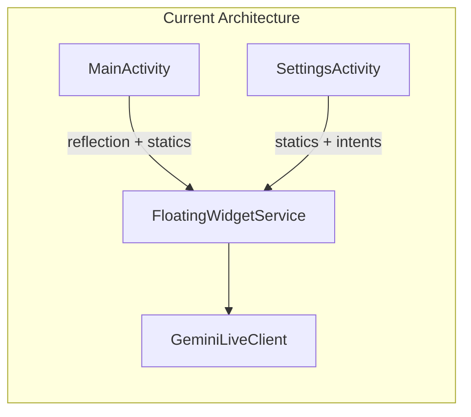
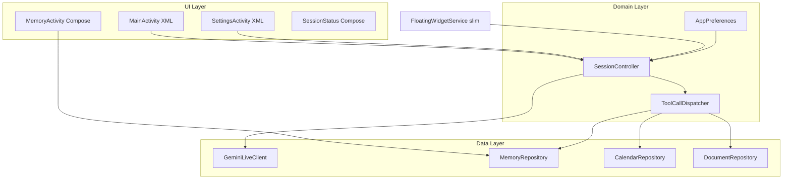
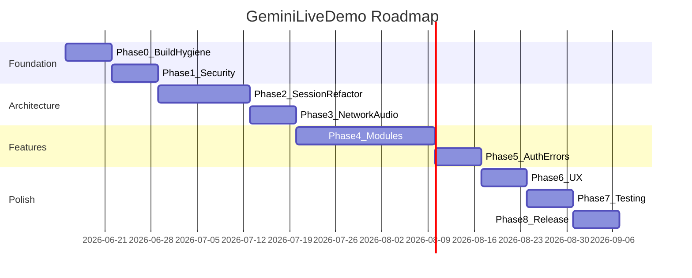

# แผนพัฒนาปรับปรุง GeminiLiveDemo (ครบทุกส่วน)

## สถานะปัจจุบัน (Baseline)

- แอป Android Kotlin ~4,900 บรรทัด, 22 ไฟล์หลัก, ไม่มี automated test จริง
- **Architecture:** Monolithic — [`FloatingWidgetService.kt`](d:\New folder (2)\GeminiLiveDemo\app\src\main\java\com\example\geminimultimodalliveapi\FloatingWidgetService.kt) (~925 บรรทัด) เป็น core ของ session, audio, tools, overlay
- **Coupling:** Static companion objects + reflection ระหว่าง [`MainActivity.kt`](d:\New folder (2)\GeminiLiveDemo\app\src\main\java\com\example\geminimultimodalliveapi\MainActivity.kt) และ Service
- **Security:** API Key เก็บ plain text ใน `GeminiPrefs` + `allowBackup="true"`
- **UI:** XML-based ([`activity_main.xml`](d:\New folder (2)\GeminiLiveDemo\app\src\main\res\layout\activity_main.xml), [`activity_settings.xml`](d:\New folder (2)\GeminiLiveDemo\app\src\main\res\layout\activity_settings.xml)); Compose theme มีแต่ไม่ได้ใช้



---

## เป้าหมายสถาปัตยกรรม (Target)



---

## Phase 0 — Build Environment และ Code Hygiene (สัปดาห์ที่ 1)

**เป้าหมาย:** Build ได้เสถียร, ลบ technical debt เล็กน้อย

| งาน | ไฟล์ที่แก้ |
|-----|-----------|
| ติดตั้ง JDK 11+ และตั้ง `JAVA_HOME` | เครื่อง dev |
| ยืนยัน `./gradlew assembleDebug` ผ่าน | ทั้งโปรเจกต์ |
| ลบ `include(":app")` ซ้ำ | [`settings.gradle.kts`](d:\New folder (2)\GeminiLiveDemo\settings.gradle.kts) |
| ลบ dependency `core-ktx` ซ้ำ | [`app/build.gradle.kts`](d:\New folder (2)\GeminiLiveDemo\app\build.gradle.kts) |
| ลบ test package เก่า `geminilivedemo` | `app/src/test/`, `app/src/androidTest/` |
| สร้าง `README.md` สั้นๆ: setup, API key, Google OAuth SHA-1 | root |

**เกณฑ์ผ่าน:** APK debug build สำเร็จ, ไม่มี duplicate module/test

---

## Phase 1 — Security และ Permissions (P0, สัปดาห์ที่ 1–2)

**เป้าหมาย:** ปกป้อง API Key และ permission ครบทุก connect path

### 1.1 API Key Security
- สร้าง [`AppPreferences.kt`](d:\New folder (2)\GeminiLiveDemo\app\src\main\java\com\example\geminimultimodalliveapi\data\AppPreferences.kt) ใช้ **EncryptedSharedPreferences** (AndroidX Security)
- ย้าย magic strings (`API_KEY`, `SELECTED_VOICE`, `WAKE_WORD`, etc.) จาก 3 ไฟล์ → constants เดียว
- อัปเดต [`backup_rules.xml`](d:\New folder (2)\GeminiLiveDemo\app\src\main\res\xml\backup_rules.xml) และ [`data_extraction_rules.xml`](d:\New folder (2)\GeminiLiveDemo\app\src\main\res\xml\data_extraction_rules.xml) ให้ **exclude** prefs ที่มี API key

### 1.2 Permission Gate
- สร้าง `PermissionHelper` — ตรวจ `RECORD_AUDIO`, `CAMERA`, `SYSTEM_ALERT_WINDOW` ก่อน connect
- เรียกจากทุก entry point: [`MainActivity.kt`](d:\New folder (2)\GeminiLiveDemo\app\src\main\java\com\example\geminimultimodalliveapi\MainActivity.kt), [`SettingsActivity.kt`](d:\New folder (2)\GeminiLiveDemo\app\src\main\java\com\example\geminimultimodalliveapi\SettingsActivity.kt), [`GeminiTileService.kt`](d:\New folder (2)\GeminiLiveDemo\app\src\main\java\com\example\geminimultimodalliveapi\GeminiTileService.kt), [`FloatingWidgetService.kt`](d:\New folder (2)\GeminiLiveDemo\app\src\main\java\com\example\geminimultimodalliveapi\FloatingWidgetService.kt)
- ลบ `READ/WRITE_EXTERNAL_STORAGE` ที่ไม่จำเป็นบน API 29+ (ใช้ MediaStore ที่มีอยู่แล้ว)

**เกณฑ์ผ่าน:** API key ไม่ถูก backup; connect จาก tile/widget/main ต้องมี permission ก่อนเสมอ

---

## Phase 2 — Session Architecture Refactor (P0–P1, สัปดาห์ที่ 2–4)

**เป้าหมาย:** ลบ reflection/static globals, แอปยังใช้งานได้ระหว่าง refactor

### 2.1 SessionController + StateFlow
สร้าง package `session/`:

```kotlin
// SessionState.kt — sealed class
sealed class SessionState {
    data object Disconnected : SessionState()
    data object Connecting : SessionState()
    data class Standby(val wakeWord: String) : SessionState()
    data class Active(val isRecording: Boolean) : SessionState()
    data class Error(val message: String) : SessionState()
}
```

- `SessionController` — interface สำหรับ connect/disconnect/toggleActive/sendFrame
- `SessionStateHolder` — `StateFlow<SessionState>`, `SharedFlow<ChatMessage>`, `SharedFlow<AppError>`
- รองรับ **หลาย observer** (แทน `statusListener` เดียว)

### 2.2 FloatingWidgetService Slim Down
แยกจาก [`FloatingWidgetService.kt`](d:\New folder (2)\GeminiLiveDemo\app\src\main\java\com\example\geminimultimodalliveapi\FloatingWidgetService.kt):

| Class ใหม่ | ความรับผิดชอบ |
|-----------|--------------|
| `OverlayWidgetController` | WindowManager, drag, bubble UI |
| `WakeWordDetector` | SpeechRecognizer lifecycle |
| `AssistantStateMachine` | STANDBY ↔ ACTIVE (public API แทน reflection) |
| `GeminiToolDispatcher` | 9 tool handlers จาก `clientListener` |
| `SessionNotificationManager` | Foreground notification |

### 2.3 ลบ Reflection ใน MainActivity
- แทนที่ reflection บน `currentState`/`transitionToState` (บรรทัด ~118–134, ~467–473) ด้วย `SessionController` API
- ลบ duplicate `MainActivity.isSessionConnected` — อ่านจาก `SessionStateHolder` เท่านั้น

### 2.4 Decouple Managers
- [`CalendarManager.kt`](d:\New folder (2)\GeminiLiveDemo\app\src\main\java\com\example\geminimultimodalliveapi\calendar\CalendarManager.kt) และ [`DocumentManager.kt`](d:\New folder (2)\GeminiLiveDemo\app\src\main\java\com\example\geminimultimodalliveapi\document\DocumentManager.kt): เปลี่ยน constructor จาก `SettingsActivity` → `FragmentActivity` + callback interface

**เกณฑ์ผ่าน:** ไม่มี reflection; MainActivity/Settings สมัคร observer ได้พร้อมกัน; `FloatingWidgetService` เหลือ < 400 บรรทัด

---

## Phase 3 — Network และ Audio Pipeline (สัปดาห์ที่ 4–5)

### 3.1 GeminiLiveClient
ไฟล์: [`GeminiLiveClient.kt`](d:\New folder (2)\GeminiLiveDemo\app\src\main\java\com\example\geminimultimodalliveapi\network\GeminiLiveClient.kt)

| แก้ไข | รายละเอียด |
|-------|-----------|
| ByteBuffer decode | ใช้ `remaining()` slice แทน `array()` |
| แยก tool JSON | ย้าย ~240 บรรทัด declarations → `ToolDefinitions.kt` |
| Reconnect | Exponential backoff 3 ครั้ง ก่อนแจ้ง error |
| Hot config | method `updateMemoryContext()` ส่ง clientContent อัปเดต mid-session |
| Tool response schema | ตรวจสอบ format กับ Live API docs, เพิ่ม logging ชัดเจน |

### 3.2 Audio
ไฟล์: [`AudioRecorder.kt`](d:\New folder (2)\GeminiLiveDemo\app\src\main\java\com\example\geminimultimodalliveapi\audio\AudioRecorder.kt), [`AudioPlayer.kt`](d:\New folder (2)\GeminiLiveDemo\app\src\main\java\com\example\geminimultimodalliveapi\audio\AudioPlayer.kt)

- แก้ bug `onConnected()` ส่ง `isRecording=true` ก่อนเวลา
- `AudioPlayer`: single-writer queue แทน concurrent coroutines
- เพิ่ม `AudioFocusRequest` — duck mic ขณะ model พูด
- สร้าง `AudioConfig` object (16k in / 24k out) แทน hard-code

**เกณฑ์ผ่าน:** Disconnect ชั่วคราว reconnect อัตโนมัติ; ไม่มี audio glitch จาก concurrent playback

---

## Phase 4 — Feature Modules (สัปดาห์ที่ 5–8)

### 4.1 Camera
ไฟล์: [`CameraCaptureHelper.kt`](d:\New folder (2)\GeminiLiveDemo\app\src\main\java\com\example\geminimultimodalliveapi\camera\CameraCaptureHelper.kt), [`MainActivity.kt`](d:\New folder (2)\GeminiLiveDemo\app\src\main\java\com\example\geminimultimodalliveapi\MainActivity.kt)

- ส่ง frame เฉพาะเมื่อ `SessionState.Active`
- Tool `open_camera` ตอบ success หลัง preview เริ่มจริง (callback จาก CameraCaptureHelper)
- แก้ shutter toast ให้แสดงหลัง capture สำเร็จ
- `close_camera` ไม่ `moveTaskToBack` — แค่หยุดส่ง frame

### 4.2 Calendar
ไฟล์: [`CalendarManager.kt`](d:\New folder (2)\GeminiLiveDemo\app\src\main\java\com\example\geminimultimodalliveapi\calendar\CalendarManager.kt), [`GoogleCalendarServiceHelper.kt`](d:\New folder (2)\GeminiLiveDemo\app\src\main\java\com\example\geminimultimodalliveapi\utils\GoogleCalendarServiceHelper.kt)

- เพิ่ม tool **`list_calendar_events`** (query 7 วันถัดไป)
- ปุ่ม Sign-in บน calendar card (ไม่พึ่ง Document section)
- Voice reminder ใช้ค่า default จาก prefs แทน hard-code 15 นาที
- `parseIsoDateTime` คืน error ชัดเจน แทน fallback +1 ชม.
- Loading/error state บน grid

### 4.3 Document
ไฟล์: [`DocumentManager.kt`](d:\New folder (2)\GeminiLiveDemo\app\src\main\java\com\example\geminimultimodalliveapi\document\DocumentManager.kt), [`DocumentParser.kt`](d:\New folder (2)\GeminiLiveDemo\app\src\main\java\com\example\geminimultimodalliveapi\utils\DocumentParser.kt)

- Sync ลบ local → ลบ Drive ด้วย
- Preview แบบแบ่งหน้า (pagination) ป้องกัน OOM
- ปรับปรุง DOCX extraction (ใช้ structured XML path)
- ซ่อน document card เมื่อยังไม่ sign-in (สอดคล้อง calendar)

### 4.4 Memory (รวม UI Compose ใหม่)
ไฟล์: [`MemoryManager.kt`](d:\New folder (2)\GeminiLiveDemo\app\src\main\java\com\example\geminimultimodalliveapi\memory\MemoryManager.kt), [`LocalVehicleDbHelper.kt`](d:\New folder (2)\GeminiLiveDemo\app\src\main\java\com\example\geminimultimodalliveapi\utils\LocalVehicleDbHelper.kt)

**Data fixes:**
- `delete_vehicle_info` ลบทั้ง vehicle DB และ semantic memory
- Upsert memory fact แทนสร้าง `fact_<timestamp>` ซ้ำทุกครั้ง
- `getFormattedContextPrompt()` ไม่ side-effect `accessCount` ตอน connect

**UI ใหม่ (Compose — Hybrid):**
- สร้าง `MemoryActivity` + `MemoryViewModel` — แสดง/แก้/ลบข้อมูลรถและ pinned facts
- ลิงก์จาก Settings → "จัดการความจำ"
- ใช้ [`ui/theme/Theme.kt`](d:\New folder (2)\GeminiLiveDemo\app\src\main\java\com\example\geminimultimodalliveapi\ui\theme\Theme.kt) ที่มีอยู่

**เกณฑ์ผ่าน:** ทุก tool ทำงาน end-to-end; memory ลบ sync ได้; มี UI ดูข้อมูลรถ

---

## Phase 5 — Google Auth และ Error Handling (สัปดาห์ที่ 8–9)

### 5.1 Google OAuth
- สร้าง `docs/GOOGLE_OAUTH_SETUP.md` — SHA-1, OAuth client, scopes
- รวม scopes ให้สอดคล้อง (Calendar + Drive)
- Token expiry → แสดง dialog ชวน re-auth แทน silent fail
- Sign-out ร่วมกันทั้ง Calendar และ Document

### 5.2 Unified Error Layer
```kotlin
sealed class AppError {
    data class Network(val msg: String) : AppError()
    data class Permission(val type: String) : AppError()
    data class Api(val code: Int, val msg: String) : AppError()
    data class Tool(val name: String, val msg: String) : AppError()
}
```
- Propagate ผ่าน `SessionStateHolder.errorFlow`
- UI: Snackbar ภาษาไทยสม่ำเสมอ (แทน Toast ปน EN/TH)

---

## Phase 6 — UX Polish (สัปดาห์ที่ 9–10)

### 6.1 Main Screen (XML — คงเดิม)
- เพิ่ม status text ใต้ปุ่ม mic: "เชื่อมต่อแล้ว / รอ Wake Word / กำลังฟัง"
- ปรับ console log: แยก USER / GEMINI สี/ prefix ชัดเจน

### 6.2 Session Status (Compose ใหม่ — Hybrid)
- Bottom sheet หรือ Activity เล็ก แสดง connection quality, idle timer, reconnect count
- เปิดจาก long-press mic หรือ Settings

### 6.3 Quick Settings Tile
ไฟล์: [`GeminiTileService.kt`](d:\New folder (2)\GeminiLiveDemo\app\src\main\java\com\example\geminimultimodalliveapi\GeminiTileService.kt)
- Tap: toggle connect/disconnect
- อัปเดต tile state ตาม `SessionStateFlow`

### 6.4 Strings
- รวม strings ภาษาไทยใน [`strings.xml`](d:\New folder (2)\GeminiLiveDemo\app\src\main\res\values\strings.xml) — ลบ hard-coded ใน Kotlin

---

## Phase 7 — Testing (สัปดาห์ที่ 10–11)

| ประเภท | เป้าหมาย | ไฟล์ |
|--------|---------|------|
| Unit | `AppPreferences`, `DocumentParser`, `MemoryManager`, `ToolDefinitions` JSON | `app/src/test/` |
| Unit | `AssistantStateMachine` transitions | `app/src/test/` |
| Instrumented | Permission flow, EncryptedSharedPreferences roundtrip | `app/src/androidTest/` |
| Manual checklist | WebSocket connect, 9 tools, wake word, overlay, tile | `docs/TEST_PLAN.md` |

**เกณฑ์ผ่าน:** Unit test coverage ≥ 40% สำหรับ domain/data layer

---

## Phase 8 — Release Hardening (สัปดาห์ที่ 11–12)

- เปิด `isMinifyEnabled = true` + ProGuard rules สำหรับ Gson/OkHttp/WebSocket
- ลบ dead code: unused imports, `serviceState` ใน MainActivity
- เพิ่ม `versionCode` / changelog
- ตรวจ battery: idle disconnect configurable ใน Settings (ค่า default 5 นาที)
- ปิด static frame re-stream 12s หรือทำให้ opt-in

---

## Timeline สรุป



**ระยะเวลารวม:** ~12 สัปดาห์ (ปรับได้ตามทีม)

---

## ลำดับความสำคัญเมื่อต้องตัด scope

1. **ห้ามตัด:** Phase 0, 1, 2.1–2.3 (security + ลบ reflection)
2. **สำคัญ:** Phase 3, 4.4 (audio bugs + memory sync)
3. **ดีมี:** Phase 4.2 list_calendar_events, Phase 6 Compose status
4. **ทำทีหลังได้:** Phase 8 ProGuard, semantic document search

---

## ไฟล์ใหม่ที่จะสร้าง (สรุป)

```
app/src/main/java/.../
├── data/AppPreferences.kt
├── session/SessionController.kt, SessionState.kt, SessionStateHolder.kt
├── service/OverlayWidgetController.kt, WakeWordDetector.kt
├── service/AssistantStateMachine.kt, GeminiToolDispatcher.kt
├── network/ToolDefinitions.kt
├── ui/memory/MemoryActivity.kt, MemoryViewModel.kt, MemoryScreen.kt (Compose)
├── ui/status/SessionStatusSheet.kt (Compose)
├── utils/PermissionHelper.kt
└── error/AppError.kt
docs/GOOGLE_OAUTH_SETUP.md, TEST_PLAN.md, README.md
```
