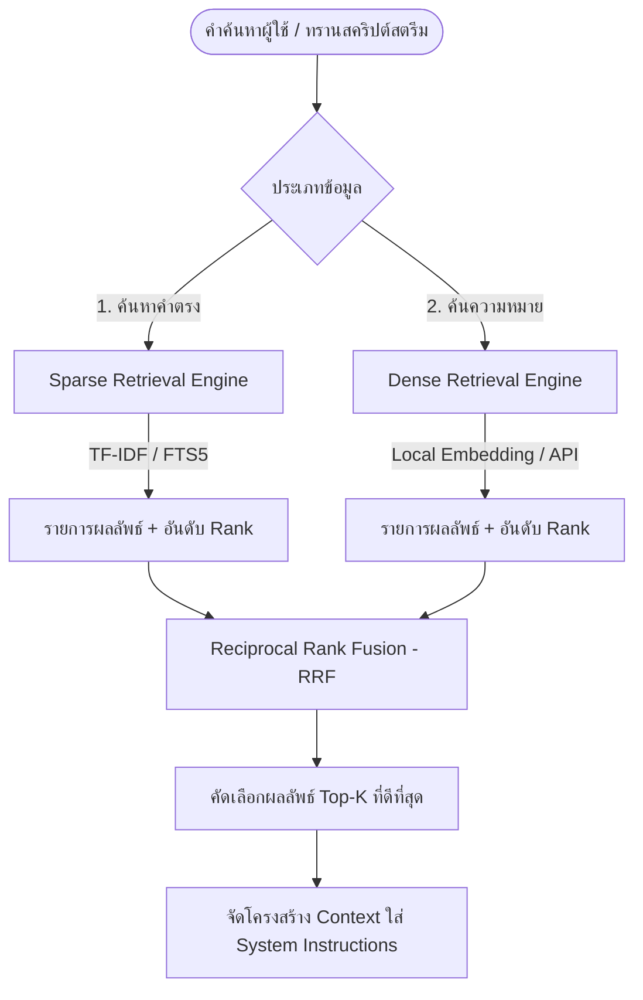

# เอกสารการออกแบบสถาปัตยกรรม: ระบบสืบค้นบริบทแบบไฮบริด (Hybrid Context Retrieval)

เอกสารฉบับนี้กำหนดรายละเอียดการปรับปรุงระบบสืบค้นข้อมูลในอุปกรณ์ (Local RAG) เพื่อเตรียมยกระดับขีดความสามารถการเข้าถึงคู่มือกรมธรรม์, ประวัติผู้ใช้ และคลังความรู้เชิงวิชาการสำหรับป้อนให้เอเจนต์สนทนาและวิเคราะห์คู่เจรจาบนแพลตฟอร์ม Hermes

---

## 1. ความจำเป็นของระบบไฮบริด (Why Hybrid Search?)

การค้นหาข้อมูลบริบทป้อนให้ปัญญาประดิษฐ์ในอุปกรณ์พกพาต้องการความแม่นยำและความเร็วสูง ภายใต้ทรัพยากรที่จำกัด:
* **ปัญหาของ Vector Search เพียงอย่างเดียว**: มักพลาดรายละเอียดที่เป็นคีย์เวิร์ดเฉพาะทาง, ตัวเลขรุ่นฮาร์ดแวร์ (เช่น XVF3800, RM520N-GL), ทะเบียนรถยนต์ หรือรหัสเฉพาะตัวซึ่งโมเดล Embedding ไม่เข้าใจความหมายเชิงความรู้สึก (Semantic)
* **ปัญหาของ Keyword Search (TF-IDF/BM25) เพียงอย่างเดียว**: ไม่เข้าใจความหมายเชิงเปรียบเทียบหรือคำไวพจน์ เช่น หากผู้ใช้พูดว่า *"การดูแลรักษาระบบล้อ"* คอนเซปต์นี้จะไม่จับคู่กับเอกสารคำว่า *"การเปลี่ยนยางและเช็คลมปะยาง"* เนื่องจากไม่มีคำพ้องสะกดตรงตัว
* **แนวทางแก้ไข**: ใช้สถาปัตยกรรมผสมผสาน **Hybrid Search (Sparse + Dense)** ควบคู่กับวิธีจัดอันดับรวม **Reciprocal Rank Fusion (RRF)** เพื่อรวมผลลัพธ์ที่ดีที่สุดจากทั้งสองแนวทาง

---

## 2. ขั้นตอนการสืบค้นข้อมูลแบบไฮบริด (Hybrid Retrieval Pipeline)

---

## 3. รายละเอียดกลยุทธ์การสืบค้นย่อย (Retrieval Sub-systems)

### 3.1 ระบบประมวลผลคำค้นตรง (Sparse Retrieval - TF-IDF / FTS)
* **เครื่องมือปัจจุบัน**: คลาส `DocumentParser.kt` ใช้วิธีคำนวณเอกสารด้วย TF-IDF ร่วมกับการซอยคำแบบ Trigrams ของภาษาไทยและคำภาษาอังกฤษดึงค่าจากไฟล์ `.txt` และ `.json` ในโฟลเดอร์ `documents/`
* **แผนพัฒนาต่อไป**: เพื่อความเร็วสูงสุดและลดการรันในหน่วยความจำ จะย้ายข้อมูลเอกสารที่มีขนาดใหญ่ไปจัดเก็บในตารางฐานข้อมูล SQLite / Room ที่เปิดใช้งานระบบ **FTS5 (Full-Text Search 5)** เพื่อช่วยให้ค้นหาคำศัพท์เฉพาะได้อย่างรวดเร็วระดับมิลลิวินาทีโดยใช้คิวรีที่เขียนล่วงหน้า

### 3.2 ระบบประมวลผลความหมายคำ (Dense Retrieval - Semantic Vector)
* **แนวทางการแปลงเวกเตอร์ (Embedding generation)**:
  - **โหมดออนไลน์ (Online)**: ยิงเรียกใช้ API `models/text-embedding-004` ของ Google เพื่อสร้างเวกเตอร์ 768 มิติสำหรับเอกสารใหม่และคำคิวรี
  - **โหมดออฟไลน์ (Offline/Local)**: ปลดล็อกใช้งานโมเดลขนาดเล็ก เช่น `MiniLM-L6-v2` หรือ `MobileBERT` รันผ่านหน่วยประมวลผลเครือข่ายประสาทส่วนกลางของแอนดรอยด์ (NPU) ด้วยไลบรารี **ONNX Runtime Mobile** หรือ **NCNN**
* **การเก็บดัชนีเวกเตอร์ (Vector Indexing)**:
  เนื่องจากฐานความรู้บนมือถือมีขนาดเล็ก (ไม่เกิน 1,000 ชิ้นย่อหน้า) การจัดเก็บเวกเตอร์สามารถทำได้ผ่านโครงสร้างหน่วยความจำอาร์เรย์ลอยตัว (Float Array) และเขียนการคำนวณมุมดักจับความคล้ายคลึง **Cosine Similarity** ในโค้ด Kotlin ตรงๆ โดยไม่ต้องพึ่งฐานข้อมูลเวกเตอร์ภายนอก ช่วยเซฟขนาดไฟล์แอปพลิเคชันได้มหาศาล

---

## 4. อัลกอริทึมรวมอันดับผลลัพธ์ (Reciprocal Rank Fusion - RRF)

เมื่อได้รับอันดับ (Rank) ของผลลัพธ์จากทั้งตัวค้นหาคำตรง (`sparse`) และตัวค้นหาตามความรู้สึก (`dense`) ระบบจะผสานคะแนนโดยใช้สมการ RRF:

\[RRF(d) = \frac{1}{k + r_{sparse}(d)} + \frac{1}{k + r_{dense}(d)}\]

โดยกำหนดค่าคงที่ปรับสมดุลเป็น \(k = 60\) (ตามหลักมาตรฐาน Rerank):
* \(r_{sparse}(d)\) คือ อันดับของเอกสาร \(d\) ในรายการที่ดึงมาจาก TF-IDF (เช่น ลำดับที่ 1, 2, ...)
* \(r_{dense}(d)\) คือ อันดับของเอกสาร \(d\) ในรายการที่ดึงมาจากระบบเวกเตอร์ความคล้ายคลึง
* เอกสารที่ได้คะแนนรวมสูงสุดจะถูกจัดเรียงเป็นเอกสารอันดับแรกและถูกส่งต่อไปประกอบบริบท RAG

---

## 5. การแบ่งส่วนและประกอบบริบท (Chunking & Context Injection)

1. **การซอยย่อยย่อหน้า (Overlapping Chunking)**:
   เอกสารจะถูกซอยย่อยเป็นย่อหน้าขนาดย่อมความยาวไม่เกิน 500 อักขระ โดยมีส่วนทับซ้อนเหลื่อมกัน (Overlap) 100 อักขระที่รอยต่อ เพื่อป้องกันไม่ให้ข้อมูลสำคัญใจความหลักขาดออกจากกัน
2. **การป้อนบริบทแบบแคช (Cached Context Injection)**:
   ระบบ RAG จะจัดเรียงและเลือกชิ้นข้อมูล Top-2 หรือ Top-3 ที่มีคะแนนสูงสุดมาประกอบเข้ากับบริบท Prompt ของระบบสนทนาเรียลไทม์ และส่งไปยังโมเดลโมดูล Gemini โดยทำการแนบแคชอายุ 5 นาที (Context Caching) เพื่อเซฟแบนด์วิดท์การทำงานเบื้องหลังไม่ให้โหลดซ้ำซ้อนขณะขับขี่รถจักรยานยนต์
