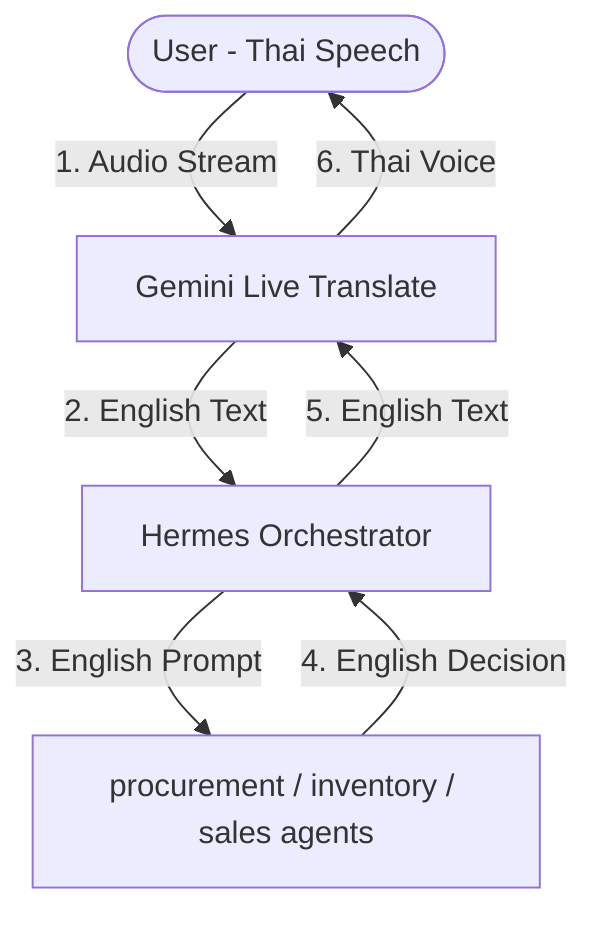
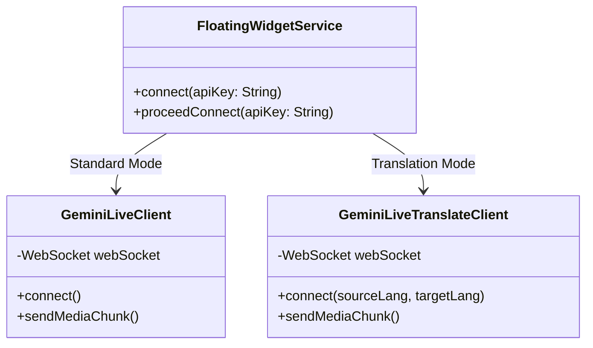

# RFC: AI Interpreter & Universal Communication Layer for Hermes

This document outlines the architectural design for integrating `gemini-3.5-live-translate-preview` into the Hermes platform to act as a **Language & Semantic Interpreter Layer**, aligning with the Business Opportunity Operating System (BOOS) vision.

---

## 1. Core Vision: Beyond a "Translator"

A standard translator replaces words in Language A with words in Language B. An **AI Interpreter** does two things:
1. **Linguistic Translation**: Maps raw speech to another language in real time (e.g., Thai Speech $\rightarrow$ English Text).
2. **Semantic Interpretation**: Extracts intent, business context, and speaker tone to feed reasoning agents (e.g., English Text $\rightarrow$ Structured Intent).

By positioning Gemini Live Translate as the **Language Layer**, we decouple language-specific speech from the core reasoning engines.

---

## 2. Dual-Mode Architecture

We propose supporting two operational modes within Hermes:

### Mode A: User-to-Agent (AI Companion Mode)
- **Use Case**: The user interacts with the Hermes Assistant (e.g., while riding a motorcycle or checking business dashboards).
- **Pipeline**:
  1. User speaks Thai.
  2. `Gemini 3.5 Live Translate` translates Thai Speech $\rightarrow$ English Text.
  3. The English text is routed to the **Hermes Orchestrator** for intent detection.
  4. The selected business agent computes a response in English.
  5. The English response is sent to `Live Translate` (or standard Gemini TTS) to stream back Thai Voice to the user.
- **Benefit**: Simplifies prompt engineering, agent rules, and tool schemas by keeping them strictly in English, where models exhibit the highest reasoning capabilities.

### Mode B: Human-to-Human (Universal Communication Layer)
- **Use Case**: Multi-lingual business meetings (e.g., Thai entrepreneur negotiating with a Japanese investor).
- **Pipeline**:
  - The Live Translate WebSocket is configured as a bidirectional channel (Thai $\leftrightarrow$ Japanese).
  - Both parties hear fluid, near-zero-latency translation with pitch/tone preservation.
  - **The Gating Agent**: Hermes listens in the background, consuming the translated English transcripts.
  - **Real-time Whispering**: If the Japanese investor states a requirement, Hermes processes the intent, checks local DBs (e.g., inventory or margins), and whispers a suggestion in the entrepreneur's ear (e.g., *"Suggest a 5% discount for orders exceeding 10,000 units"*).

---

## 3. Technical Integration Plan

Since Hermes already uses the **Gemini Multimodal Live API** infrastructure, the integration fits neatly into the existing architecture:

### Key Technical Steps:
1. **Model Configuration**:
   - Establish connection to `wss://generativelanguage.googleapis.com/ws/google.ai.generativelanguage.v1beta.GenerativeService.BidiGenerateContent` using the model identifier `models/gemini-3.5-live-translate-preview`.
2. **Audio Pipeline Matching**:
   - Audio input remains raw **16-bit PCM at 16kHz** (matching our current `AudioRecorder` setup).
   - Audio output remains **24kHz PCM** (matching our `AudioPlayer` jitter buffer).
3. **Configuration Payload**:
   - Send translation configurations specifying the target languages (e.g., `sourceLanguage: "th"`, `targetLanguage: "en"`).

---

## 4. Business Opportunities & BOOS Alignment

This layer upgrades Hermes from a mobile assistant to an **enterprise-grade negotiation companion**:
- **Term Translation**: Translates business slang and idioms accurately (e.g., translating Thai colloquial business phrases into proper financial terms).
- **Negotiation Analytics**: Real-time analysis of client interest, sentiment, and commitment levels.
- **Hands-Free Integration**: Operates fully through motorcycle headsets, enabling real-time business operation monitoring while on the move.
